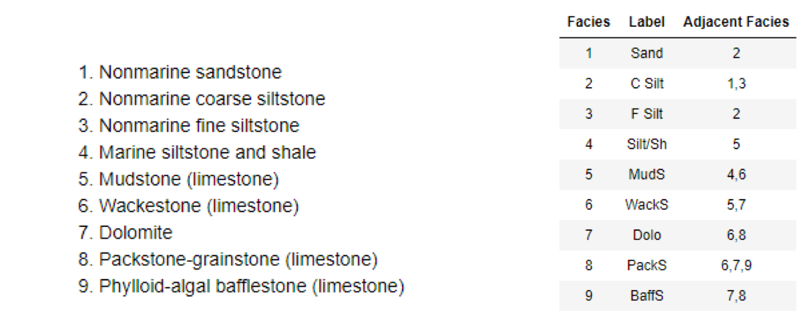

## Facies Classification
This repository and [notebook](https://github.com/Philliec459/facies_classification/blob/master/Facies%20Classification%20-%20SVM%20-%20MATT.ipynb) are from Brendon Hall [repository](https://github.com/brendonhall/facies_classification). Brendon has developed a great demonstration of how to use the machine learning algorithm (support vector machine) to train well logs to be able to assign Geologic Facies.  This is great work from Brendon and an extremely useful example that should benefit the Petrophysical/Geological community greatly. 

Brendon assembled the training data based on expert geologic core descriptions that are integrated with wireline log data for nine wells.  These data are used to train a support vector machine to identify facies based only on wireline log data. This is an example of supervised training. This example is based on a class exercise from the University of Kansas that can be [found online](http://www.people.ku.edu/~gbohling/EECS833/).  

The only think that I have provided is to update this repository on our fork only to be compatible with the newest Python 3.7 libraries, and the rest is Brendon.  

The Jupyter Notebooks (Facies Classification - SVM - MATT.ipynb and Facies Classification - SVM.ipynb) examples written by Brendon are very helpful in understanding the programming. They show a step-by-step discussion of the code, concepts and example plots as shown below. These Notebooks are actual code and the plots are the actual results from running this code in Jupyter Notebook. We are using an Anaconda3 distro for our work which includes both Jupyter Notebook and Jupyter Lab. 

The following are the Geologic Facies being predicted in this example:

Example Depth Plot showing typical well logs and Geologic Facies:

The following is a histogram of the Training Data by Facies:

Seaborn is used to create the following Matrix Plot:

Brendon provides some metrics to evaluate how well the classifier is doing. A confusion matrix is a table that is used to describe the performance of a classification model. Scikit-learn allows us to easily create a confusion matrix by supplying the actual and predicted facies labels. The confusion matrix is simply a 2D array. The entries of confusion matrix C[i][j] are equal to the number of observations predicted to have facies j, but are known to have facies i.

To simplify reading the confusion matrix, Brendon has written a function to display these matrix data along with facies labels and various error metrics. Please see the file classification_utilities.py in this repo for the display_cm() function.

Often a separate 'cross validation' dataset will be created in addition to the training and test sets to do model selection. For this tutorial Brendon has used just the test set to choose the final model parameters. The best accuracy on the cross validation error curve was achieved for gamma = 1, and C = 10. We can now create and train an optimized classifier based on these parameters.

The following images shows how well the program performs with a Blind Test where the Newby well was held back from the training data set and the following are the results. 

I have changed the name of the Geologic Facies for the .py files to be a bit more intuitive.
